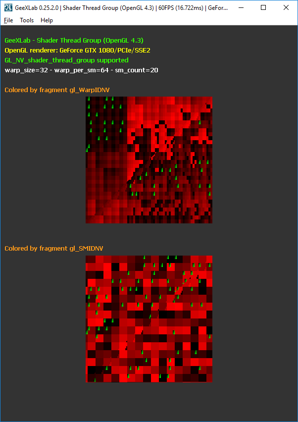

This demo shows how a NVIDIA GPU draws a quad by visualizing some GLSL built-in variables: gl_ThreadInWarpNV, gl_WarpIDNV and gl_SMIDNV (GL_NV_shader_thread_group support is required).

The article also discusses about SMs, WARPS, threads and how the number of GPU cores can be computed.
  
Article + downloads links:
- https://www.geeks3d.com/hacklab/20180705/demo-visualizing-nvidia-gl_threadinwarpnv-gl_warpidnv-and-gl_smidnv-gl_nv_shader_thread_group/

<b>Screenshots</b>

